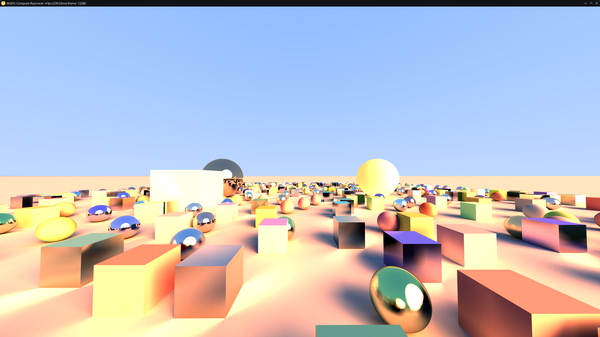
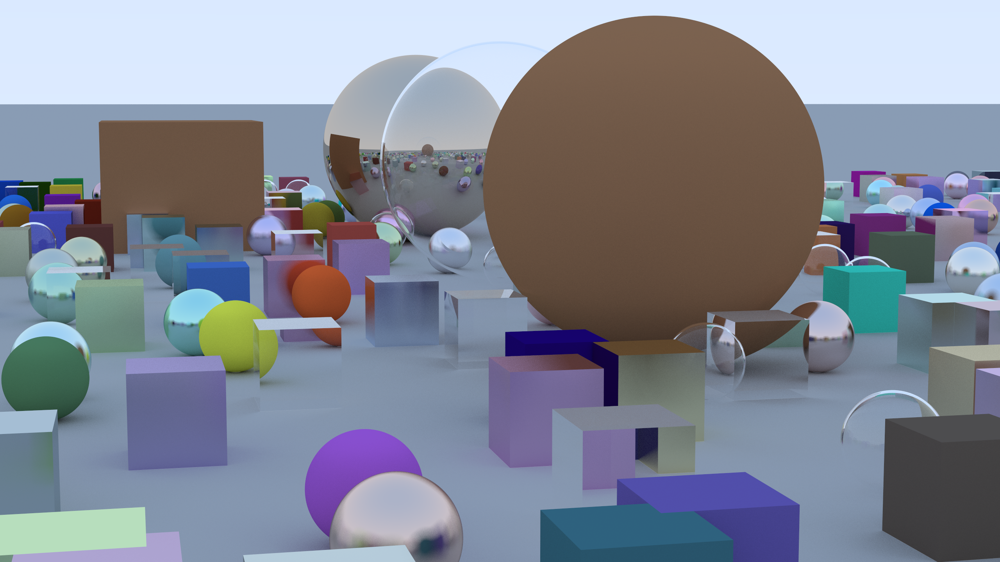

# Raytracer

Implementation of the [Raytracing Series](https://raytracing.github.io/) to learn rust

Features:
- [X] cpu software implementation (headless)
- [X] interactive window with cpu implementation
- [X] GPU accelerated implementation (using compute shaders in wgpu)
- [X] Hot reloading gpu shaders almost instantly
- [ ] headless mode for gpu implementation

## Sample

### GPU accelerated raytracing (interactive, no RTX graphics card required!)
```bash
cd raytracer_gpu
cargo r --release
```


### CPU software raytracing
generated using:
```bash
cargo run --release -p raytracer_headless
```


interactive version:
```bash
cargo run --release -p raytracer_runtime
```